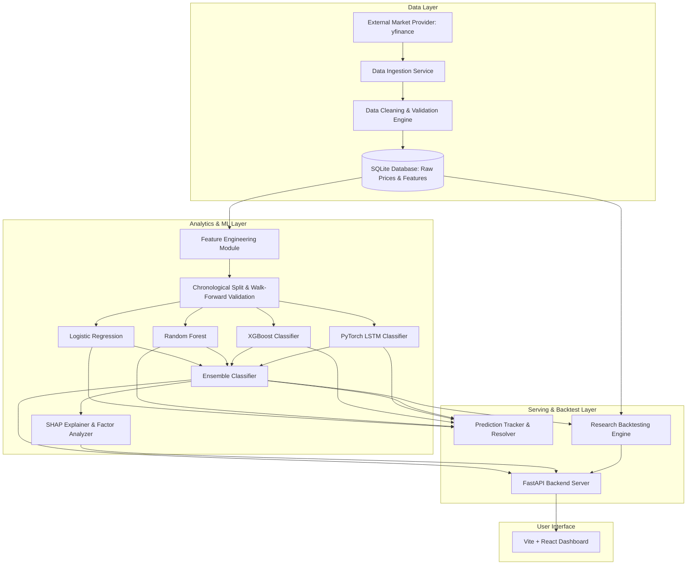

# StockSense AI — System Architecture & Implementation Plan

> **DISCLAIMER & RESEARCH NOTICE**  
> StockSense AI is an educational and academic research machine-learning platform created strictly for evaluating directional stock price modeling methodologies. It is **NOT** financial advice, nor does it guarantee trading profits or return accuracy. All backtests, predictions, and metrics are empirical historical evaluations and do not imply future financial performance.

---

## 1. Executive Summary & Goal
StockSense AI provides an explainable, continuously evaluated machine-learning pipeline to predict next-day stock price direction (**UP = 1**, **DOWN = 0**) for a configurable universe of Indian equities (starting with `RELIANCE`, `TCS`, `INFY`, `HDFCBANK`, `ICICIBANK`). The system strictly avoids target leakage, implements chronological time-series splitting, trains multiple baseline and sequence models, tracks actual outcomes automatically, and presents real-time evaluation and risk metrics.

---

## 2. System Architecture Overview

---

## 3. Detailed Component Architecture

### A. Data Pipeline
- **Provider**: `yfinance` retrieving daily OHLCV (`date`, `open`, `high`, `low`, `close`, `volume`) for Indian equities mapped to Yahoo Finance symbols (`RELIANCE.NS`, `TCS.NS`, `INFY.NS`, `HDFCBANK.NS`, `ICICIBANK.NS`).
- **Validation**: Checks for missing trading days, zero/negative prices, volume anomalies, and missing values.
- **Error Handling**: Graceful error logging when external market data service is unavailable with setup instructions and zero synthetic data fabrication.

### B. Feature Engineering & Target Construction
- **Technical Indicators** (strictly backward-looking rolling windows at time $t$):
  - **SMA**: SMA 10, SMA 20, SMA 50
  - **EMA**: EMA 10, EMA 20
  - **RSI**: 14-day Relative Strength Index
  - **MACD**: MACD line, Signal line, MACD Histogram (12, 26, 9)
  - **Bollinger Bands**: Upper band, Lower band, Bandwidth (20-day, 2 std dev)
  - **Returns & Volatility**: Daily percentage return ($R_t = \frac{C_t - C_{t-1}}{C_{t-1}}$), 20-day Rolling Volatility ($\sigma_{20}$), 1-day Volume Percentage Change.
- **Target Construction**:
  - $Target_{t} = 1$ if $Close_{t+1} > Close_t$, else $0$.
  - Target generation explicitly uses `shift(-1)` for training labels **ONLY**. Feature calculations strictly use $t \le \tau$, eliminating any future information leakage.

### C. Time-Series Validation Strategy
- **Chronological Splitting**: Data is ordered strictly by date.
  - **Train set**: 70%
  - **Validation set**: 15%
  - **Test set**: 15% (held out untouched until final evaluation).
- **Walk-Forward Validation**: Rolling/expanding window cross-validation for hyperparameter tuning without future lookahead.

### D. Model Suite & Calibration
1. **Baseline Models**:
   - Logistic Regression (L2 regularization, standard scaled features)
   - Random Forest Classifier (balanced class weights)
   - XGBoost Classifier (gradient boosting with early stopping)
2. **Deep Learning Model**:
   - PyTorch LSTM Classifier utilizing chronological historical sequence windows ($[t-L, t]$) to predict $Target_t$.
3. **Ensemble Model**:
   - Weighted probability average combining calibrated outputs of baselines & LSTM.
4. **Probability Calibration & Evaluation**:
   - Scikit-learn Platt Scaling / `CalibratedClassifierCV`
   - Metrics: Accuracy, Precision, Recall, F1-Score, ROC-AUC, Confusion Matrix, Brier Score, and Calibration Curves.

### E. Prediction Tracking & Continuous Evaluation
- SQLite Table `predictions`:
  - `id`, `stock_symbol`, `prediction_date`, `predicted_direction`, `probability_up`, `probability_down`, `model_version`, `prediction_timestamp`, `actual_direction`, `is_correct`, `resolved_at`.
- **Auto-Resolution Scheduler**: When new market daily close data arrives, historical pending predictions are updated with actual outcomes without modifying past predicted values.

### F. Explainability & Risk Assessment
- **Feature Importance & SHAP Values**: Calculates SHAP summary values for XGBoost/Random Forest and translates them into plain-English dynamic factors (e.g. "EMA 10 > EMA 20 indicates strong positive trend (+0.14 UP prob)", "RSI > 70 indicates overbought conditions (-0.08 UP prob)").
- **Risk Assessment**: Categorizes model confidence into `LOW` (prob 50–55%), `MEDIUM` (prob 55–65%), `HIGH` (prob > 65%) with probability calibration disclaimers.

### G. Research Backtesting Module
- Strategy comparisons:
  1. **Buy and Hold Baseline**
  2. **Simple Prediction Strategy** (Long on UP prediction, Cash on DOWN prediction)
  3. **AI Probability Threshold Strategy** (Long when UP prob > 0.6, Short/Cash otherwise)
- Performance metrics: Total Return %, CAGR %, Max Drawdown %, Sharpe Ratio, Trade Count, Win Rate %.
- **Transaction Costs**: Configurable slippage & commission (e.g., 0.1% per trade).

### H. FastAPI Endpoint Architecture
- `GET /api/stocks`: List configured universe.
- `GET /api/stocks/{symbol}/history`: Historical OHLCV data.
- `GET /api/stocks/{symbol}/features`: Historical computed feature matrix.
- `GET /api/stocks/{symbol}/prediction`: Latest AI directional prediction, probabilities, risk, & explanation.
- `GET /api/models`: Model registry & performance metrics.
- `GET /api/predictions`: Prediction history log & auto-resolved outcomes.
- `GET /api/performance`: Stock-wise and model-wise accuracy metrics.
- `POST /api/backtest`: Execute backtest simulations with custom parameters.
- `POST /api/refresh`: Data ingestion, model inference, & resolution update.
- `POST /api/auth/login`: User authentication.

### I. Dashboard User Interface (Frontend)
- Built with React + Vite, styled with modern dark glassmorphism Vanilla CSS.
- Real-time stock search, interactive price & indicator charts, AI prediction cards, SHAP explanation breakdown, model comparison matrix, backtesting simulator, and prediction tracking table.

### J. Future News Sentiment Integration Plan
- Architecture hook designed for NLP news sentiment integration:
  - Ingestion module for financial headlines & SEC/NSE filings.
  - Fine-tuned FinBERT / VADER sentiment scorer yielding Daily Sentiment Score $S_t \in [-1, 1]$ and Aggregated Volume Sentiment.
  - Seamlessly appended to feature matrix as $Sentiment_t$ for hybrid technical + sentiment modeling.

---

## 4. Verification & Testing Plan
1. **Future Leakage Test**: Pytest unit test enforcing that feature matrices generated with shifted targets do not contain correlations with future price changes.
2. **Indicator Validation**: Verify technical indicators against reference values.
3. **Data Integrity Test**: Ensure no synthetic data generation occurs on provider failure.
4. **API & Backtest Tests**: Test endpoint outputs and portfolio calculation invariants.

---

## 5. Execution Roadmap
- **Phase 1-2**: Config setup, SQLite schema, `yfinance` Data Ingestion Service.
- **Phase 3-5**: Feature Engineering Engine, Target Generator, Chronological & Walk-Forward Splitter.
- **Phase 6-9**: Logistic Regression, Random Forest, XGBoost, PyTorch LSTM, and Probability Ensemble.
- **Phase 10-14**: SHAP Explainability Engine, Prediction Tracker & Auto-Resolver, Research Backtester, Risk Evaluator.
- **Phase 15-16**: FastAPI API endpoints & React/Vite Glassmorphism Frontend.
- **Phase 17-19**: Data Refresh Pipeline, Pytest Suite, Zero-False-Claims Verification, and Final Documentation.
