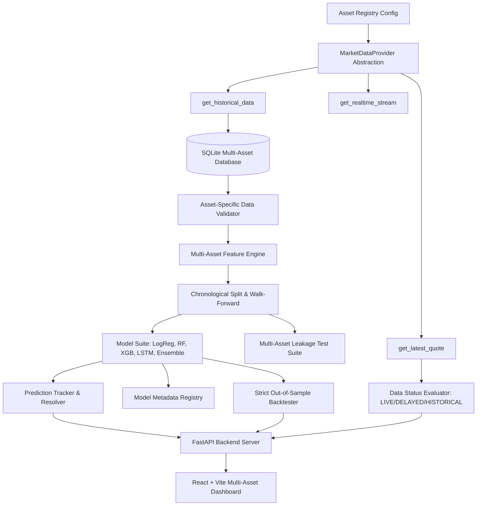

# StockSense AI — Multi-Asset AI Market Research Platform Upgrade Plan

> **RESEARCH DISCLAIMER**  
> StockSense AI is an academic and educational machine-learning research platform for studying directional market prediction across multi-asset classes. It is **NOT** financial advice, nor does it guarantee trading profits or prediction accuracy. All market data, metrics, predictions, and backtests must strictly reflect empirical historical evaluation.

---

## User Review Required

> [!IMPORTANT]
> **MULTI-ASSET CLASS & DATA FRESHNESS ARCHITECTURE**:
> 1. Support 5 Asset Classes: Indian Equities, US Equities, Crypto, Forex, and Global Indices.
> 2. Market Data Provider Abstraction (`MarketDataProvider`) separating:
>    - `get_historical_data()`
>    - `get_latest_quote()`
>    - `get_realtime_stream()`
> 3. Data Freshness Status Tags: `LIVE`, `DELAYED`, `HISTORICAL`, `UNAVAILABLE`.
> 4. Strict Isolation: Live/latest quotes never modify or overwrite historical training/testing datasets.
> 5. Zero False Claims: Never label yfinance or static quotes as `LIVE` unless a true real-time streaming provider is attached.

---

## 1. System Architecture & Component Inventory



---

## 2. Asset Registry & Initial Universe Configuration

The system defines 5 primary asset classes in `backend/assets/asset_registry.py`:

```python
ASSET_CLASSES = {
    "INDIAN_EQUITY": "Indian Equities (NSE/BSE)",
    "US_EQUITY": "US Equities (NASDAQ/NYSE)",
    "CRYPTO": "Cryptocurrency 24/7",
    "FOREX": "Foreign Exchange Pairs",
    "INDEX": "Global Market Indices"
}
```

### Configured Initial Universe (21 Assets Total)

| Asset Class | Symbol | Display Name | Provider Ticker | Currency | Calendar / Session |
|---|---|---|---|---|---|
| **INDIAN_EQUITY** | `RELIANCE` | Reliance Industries Ltd | `RELIANCE.NS` | INR (₹) | NSE Trading Session |
| **INDIAN_EQUITY** | `TCS` | Tata Consultancy Services | `TCS.NS` | INR (₹) | NSE Trading Session |
| **INDIAN_EQUITY** | `INFY` | Infosys Limited | `INFY.NS` | INR (₹) | NSE Trading Session |
| **INDIAN_EQUITY** | `HDFCBANK` | HDFC Bank Ltd | `HDFCBANK.NS` | INR (₹) | NSE Trading Session |
| **INDIAN_EQUITY** | `ICICIBANK` | ICICI Bank Ltd | `ICICIBANK.NS` | INR (₹) | NSE Trading Session |
| **US_EQUITY** | `AAPL` | Apple Inc. | `AAPL` | USD ($) | US NASDAQ/NYSE |
| **US_EQUITY** | `MSFT` | Microsoft Corporation | `MSFT` | USD ($) | US NASDAQ/NYSE |
| **US_EQUITY** | `NVDA` | NVIDIA Corporation | `NVDA` | USD ($) | US NASDAQ/NYSE |
| **US_EQUITY** | `AMZN` | Amazon.com Inc. | `AMZN` | USD ($) | US NASDAQ/NYSE |
| **US_EQUITY** | `GOOGL` | Alphabet Inc. | `GOOGL` | USD ($) | US NASDAQ/NYSE |
| **CRYPTO** | `BTC-USD` | Bitcoin / US Dollar | `BTC-USD` | USD ($) | 24/7 Continuous |
| **CRYPTO** | `ETH-USD` | Ethereum / US Dollar | `ETH-USD` | USD ($) | 24/7 Continuous |
| **FOREX** | `USDINR=X` | US Dollar / Indian Rupee | `USDINR=X` | INR (₹) | 24/5 FX Session |
| **FOREX** | `EURUSD=X` | Euro / US Dollar | `EURUSD=X` | USD ($) | 24/5 FX Session |
| **FOREX** | `GBPUSD=X` | British Pound / US Dollar | `GBPUSD=X` | USD ($) | 24/5 FX Session |
| **FOREX** | `USDJPY=X` | US Dollar / Japanese Yen | `USDJPY=X` | JPY (¥) | 24/5 FX Session |
| **INDEX** | `^NSEI` | NIFTY 50 Index | `^NSEI` | INR (₹) | NSE Trading Session |
| **INDEX** | `^NSEBANK` | NIFTY Bank Index | `^NSEBANK` | INR (₹) | NSE Trading Session |
| **INDEX** | `^GSPC` | S&P 500 Index | `^GSPC` | USD ($) | US Trading Session |
| **INDEX** | `^IXIC` | NASDAQ Composite Index | `^IXIC` | USD ($) | US Trading Session |
| **INDEX** | `^DJI` | Dow Jones Industrial Avg | `^DJI` | USD ($) | US Trading Session |

---

## 3. Data Freshness & Real-Time Data Architecture

### Data Provider Abstraction (`MarketDataProvider`)
```python
class MarketDataProvider(ABC):
    @abstractmethod
    def get_historical_data(self, provider_symbol: str, start_date: str = None, end_date: str = None) -> pd.DataFrame:
        pass

    @abstractmethod
    def get_latest_quote(self, provider_symbol: str) -> Dict[str, Any]:
        """
        Returns: {
            "price": float,
            "timestamp": datetime,
            "timezone": str,
            "provider": str,
            "data_status": "LIVE" | "DELAYED" | "HISTORICAL" | "UNAVAILABLE",
            "is_delayed": bool
        }
        """
        pass

    @abstractmethod
    def get_realtime_stream(self, provider_symbol: str):
        """Optional/Provider-dependent streaming socket hook."""
        pass
```

### Data Freshness Status Matrix
- `LIVE`: True WebSocket/streaming connection (e.g. licensed broker API).
- `DELAYED`: 15-minute delayed market quotes (standard yfinance ticker quote).
- `HISTORICAL`: Daily historical bar close price.
- `UNAVAILABLE`: Data feed unreachable or symbol invalid.

---

## 4. Multi-Asset Database Schema Extensions

We extend `backend/db/models.py` to support multi-asset persistence:

- **`Asset` Table**: `id`, `symbol`, `display_name`, `asset_class`, `exchange`, `currency`, `provider_symbol`, `timezone`, `trading_calendar`, `is_active`
- **`MarketData` Table**: `id`, `asset_id`, `symbol`, `timestamp/date`, `open`, `high`, `low`, `close`, `volume`, `provider`, `created_at` (Indexed on `(symbol, date)`)
- **`FeatureData` Table**: Stores computed features with asset-class tags.
- **`ModelMetadata` Table**: `id`, `model_name`, `version`, `asset_class`, `symbol`, `training_start`, `training_end`, `metrics_json`, `file_path`, `created_at`
- **`PredictionRecord` Table**: `id`, `asset_symbol`, `asset_class`, `as_of_date`, `prediction_date`, `predicted_direction`, `probability_up`, `probability_down`, `risk_category`, `signal_strength`, `actual_direction`, `is_correct`, `resolved_at`

---

## 5. Feature Engineering & Target Definition

### Feature Matrix (21 Indicators)
- **Moving Averages**: SMA 10, SMA 20, SMA 50, EMA 10, EMA 20
- **Oscillators**: RSI (14), MACD (12,26,9), MACD Signal, MACD Histogram
- **Volatility**: Bollinger Upper, Bollinger Lower, Bollinger Bandwidth, 20-Day Rolling Volatility
- **Momentum & Relative Price**: Daily Return, Distance to SMA 20 (`close / sma_20 - 1`), EMA Crossover (`ema_10 - ema_20`), Volume % Change

### Target Construction ($T \rightarrow T+1$)
- Binary Target at day $T$:
  $$Target_T = \begin{cases} 1 & \text{if } Close_{T+1} > Close_T \\ 0 & \text{otherwise} \end{cases}$$
- **Data Leakage Guarantee**: Features at time index $T$ utilize strictly past information ($t \le T$). Future prices are used **ONLY** for training label assignment.

---

## 6. Model Suite & Calibration

1. **Majority Class Baseline**
2. **Logistic Regression**
3. **Random Forest Classifier**
4. **XGBoost Classifier**
5. **PyTorch LSTM Sequence Model**
6. **Calibrated Probability Ensemble Model**

### Probability & Signal Strength Classification
- **UP Probability**: $P(\text{UP}) \in [0, 1]$
- **DOWN Probability**: $P(\text{DOWN}) = 1 - P(\text{UP})$
- **Signal Strength Categories**:
  - `50% - 55%`: **LOW SIGNAL STRENGTH**
  - `55% - 65%`: **MEDIUM SIGNAL STRENGTH**
  - `> 65%`: **HIGH SIGNAL STRENGTH**

---

## 7. Strict Out-of-Sample Backtesting Engine

- **Strict Data Scope**: Backtests execute **ONLY** on the held-out 15% out-of-sample test set (179 trading days). Full 5-year in-sample backtesting is prohibited on the user dashboard.
- **Execution Convention**: Close-to-Close Execution. Signal at $T-1$ Close trades at $T-1$ Close and holds until $T$ Close.
- **Trading Friction**: 0.10% commission + 0.05% slippage = **0.15% friction per trade**.
- **Metrics**: Initial Capital, Final Capital, Total Return %, CAGR %, Max Drawdown %, Sharpe Ratio, Trade Count, Win Rate %, Buy & Hold Baseline comparison.

---

## 8. REST API Endpoints Plan

### New Multi-Asset Endpoints
- `GET /api/asset-classes` — Returns list of supported asset classes.
- `GET /api/assets` — Returns registered assets (filtered by `asset_class`).
- `GET /api/assets/{symbol}` — Returns metadata for specific asset.
- `GET /api/assets/{symbol}/history` — Returns historical market OHLCV data.
- `GET /api/assets/{symbol}/features` — Returns computed feature matrix.
- `GET /api/assets/{symbol}/prediction` — Returns latest AI prediction, probabilities, risk category, and SHAP factors.
- `GET /api/assets/{symbol}/performance` — Returns test-set evaluation metrics.
- `GET /api/assets/{symbol}/predictions` — Returns prediction history & resolution outcome log.
- `POST /api/assets/{symbol}/refresh` — Triggers real data ingestion & feature sync.
- `POST /api/assets/{symbol}/backtest` — Executes out-of-sample backtest simulation.

*Note: Existing endpoints (`/api/stocks`, `/api/backtest`, etc.) remain fully functional as aliases for backward compatibility.*

---

## 9. Incremental Phase Rollout & Training Policy

### Rollout Policy
1. **Phase A (Indian Equities)**: Verify existing 5 Indian stock pipelines, database schemas, and unit tests stay 100% functional.
2. **Phase B (US Equities)**: Ingest `AAPL`, `MSFT`, `NVDA`, `AMZN`, `GOOGL` real data $\rightarrow$ Validate $\rightarrow$ Compute features $\rightarrow$ Run leakage tests $\rightarrow$ Train models $\rightarrow$ Evaluate.
3. **Phase C (Global Indices)**: Ingest `^NSEI`, `^NSEBANK`, `^GSPC`, `^IXIC`, `^DJI` $\rightarrow$ Validate without volume dependency $\rightarrow$ Train & Evaluate.
4. **Phase D (Cryptocurrency)**: Ingest `BTC-USD`, `ETH-USD` $\rightarrow$ Validate 24/7 calendar $\rightarrow$ Train & Evaluate.
5. **Phase E (Forex Pairs)**: Ingest `USDINR=X`, `EURUSD=X`, `GBPUSD=X`, `USDJPY=X` $\rightarrow$ Handle FX volume limits $\rightarrow$ Train & Evaluate.

### Zero False Claims Guarantee
- If an asset's model is not trained yet, display: `"Model not trained for this asset."`
- If market data is unavailable, display: `"Real market data unavailable."`
- Zero fabricated predictions or synthetic accuracy numbers.

---

## 10. Verification Plan

### Automated Tests
- `tests/test_asset_registry.py` — Verifies 21 asset configurations and currency mappings.
- `tests/test_data_provider.py` — Verifies historical data separation from quotes, data_status tagging, and stale data detection.
- `tests/test_multi_asset_leakage.py` — Verifies strict leakage protection across all 5 asset classes.
- `tests/test_api.py` — Multi-asset REST API endpoints.

### Manual Verification
- Test interactive asset switching between NSE Stocks, US Stocks, Crypto, Forex, and Indices in React UI.
- Verify price currency formatting (₹, $, ¥) and data status badges (`🟡 DELAYED` vs `🟢 LIVE`).
